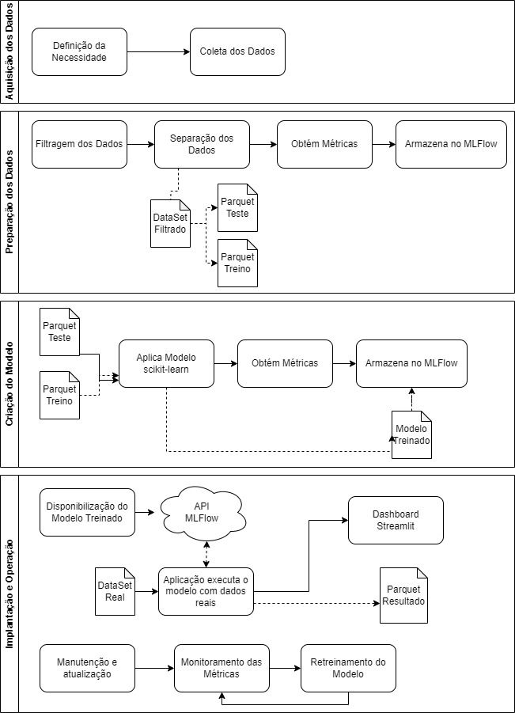

## <b>Pergunta 1</b>:
A solução criada nesse projeto deve ser disponibilizada em repositório git e disponibilizada em servidor de repositórios (Github (recomendado), Bitbucket ou Gitlab). O projeto deve obedecer o Framework TDSP da Microsoft (estrutura de arquivos, arquivo requirements.txt e arquivo README). Todos os artefatos produzidos deverão conter informações referentes a esse projeto (não serão aceitos documentos vazios ou fora de contexto). Escreva o link para seu repositório. 

## <b> Resposta 1</b>: https://github.com/rlzimmer/ml_infnet_2024

## <b>Pergunta 2</b>:
Para começar o desenvolvimento, desenhe um diagrama que demonstra todas as etapas necessárias em um projeto de inteligência artificial, desde a aquisição de dados, passando pela criação dos modelos, indo até a operação do modelo.

## <b> Resposta 2</b>:

## <b>Pergunta 3</b>:
Descreva a importância de implementar pipelines de desenvolvimento e produção numa solução de aprendizado de máquinas.

## <b> Resposta 3</b>:

A implementação de pipelines de desenvolvimento e produção em projetos de machine learning (ML) é uma garantia para a eficiência, reprodutibilidade e escalabilidade do ciclo de vida do projeto. Esses pipelines automatizam e gerenciam de forma sistemática todas as etapas, desde a preparação dos dados até a implantação e monitoramento dos modelos, destacando-se por vários motivos:

a. Eficiência e Automação: Automatizam processos repetitivos, reduzindo tempo e erros manuais, o que aumenta a eficiência do desenvolvimento.
b. Reprodutibilidade: Asseguram que experimentos e modelos possam ser exatamente reproduzidos, crucial para a validação científica e ajustes futuros.
c. Consistência: Garantem condições consistentes de treinamento e avaliação dos modelos entre diferentes ambientes, minimizando discrepâncias ao mover modelos para produção.
d. Gerenciamento de Dependências: Facilitam o gerenciamento de pacotes e bibliotecas necessárias, evitando problemas de incompatibilidade entre diferentes ambientes de execução.
e. Escalabilidade: São projetados para se adaptarem a aumentos no volume de dados ou demandas de computação, mantendo a eficiência em ambientes de produção.
f. Versionamento e Controle de Qualidade: Facilitam o versionamento de modelos e dados, essencial para controle de qualidade e acompanhamento da performance ao longo do tempo.
g. Monitoramento e Manutenção: Permitem o monitoramento contínuo dos modelos para correção rápida de qualquer problema, garantindo sua eficácia e relevância frente a novos dados e contextos.

## <b>Pergunta 4</b>:
Como as ferramentas Streamlit, MLFlow, PyCaret e Scikit-Learn auxiliam na construção dos pipelines descritos anteriormente? A resposta deve abranger os seguintes aspectos: Rastreamento de experimentos; Funções de treinamento; Monitoramento da saúde do modelo; Atualização de modelo; Provisionamento (Deployment).

## <b> Resposta 4</b>:

Ferramentas como — Streamlit, MLFlow, PyCaret e Scikit-Learn — oferecem uma variedade de funcionalidades que facilitam a construção e gerenciamento de pipelines de aprendizado de máquinas, cobrindo desde a fase inicial de desenvolvimento até o monitoramento e atualização de modelos em produção. Vamos explorar como cada ferramenta contribui para diferentes aspectos do processo.

a. Rastreamento de Experimentos: MLFlow é uma plataforma open source para gerenciar o ciclo de vida de ML, incluindo rastreamento de experimentos, empacotamento de código, implantação de modelos e um registro central de modelos. O rastreamento de experimentos permite que os cientistas de dados registrem e comparem parâmetros, métricas e artefatos de diferentes runs de treinamento, facilitando a identificação das melhores configurações e modelos.

b. Funções de Treinamento: Scikit-Learn e PyCaret
Scikit-Learn é uma biblioteca de aprendizado de máquinas em Python que fornece uma ampla gama de algoritmos de aprendizado supervisionado e não supervisionado, processamento de dados, seleção de modelos e métricas de avaliação, facilitando o desenvolvimento de pipelines de treinamento robustos e reprodutíveis.
PyCaret é uma biblioteca de automação de machine learning que simplifica muitas tarefas envolvidas no ciclo de vida de um projeto de ML. PyCaret é particularmente útil para funções de treinamento, pois permite a comparação fácil de diferentes modelos para encontrar o melhor desempenho com menos código.

c. Monitoramento da Saúde do Modelo: Embora o MLFlow não ofereça diretamente funcionalidades de monitoramento da saúde do modelo em tempo real, ele facilita a integração com outras ferramentas e sistemas de monitoramento. O registro central de modelos e a documentação de cada experimento permitem que as equipes acompanhem o desempenho do modelo ao longo do tempo e identifiquem quando é necessário reavaliar ou atualizar um modelo.

d. Atualização de Modelo: MLFlow e PyCaret
MLFlow facilita a atualização de modelos através de seu registro de modelos, onde diferentes versões podem ser facilmente comparadas, avaliadas e promovidas para produção conforme necessário.
PyCaret simplifica o re-treinamento e a atualização de modelos com sua interface de alto nível, permitindo a rápida reavaliação de modelos com novos dados ou parâmetros.

e. Provisionamento (Deployment): MLFlow, PyCaret, e Streamlit
MLFlow oferece funcionalidades para empacotar modelos como contêineres Docker, facilitando o deployment em diversos ambientes, incluindo servidores locais e serviços de nuvem.
PyCaret facilita o deployment de modelos através da integração com várias plataformas, como AWS, Azure ML e Heroku, permitindo que os modelos sejam facilmente disponibilizados como APIs ou serviços web.
Streamlit é uma ferramenta que permite a criação rápida de aplicativos web para ML e análise de dados. Enquanto não é uma ferramenta de deployment no sentido tradicional, Streamlit pode ser usado para construir interfaces de usuário interativas para modelos de ML, facilitando o compartilhamento de resultados e a interação com stakeholders.
Cada uma dessas ferramentas desempenha um papel importante na construção, gestão e operacionalização de pipelines de aprendizado de máquinas, desde o estágio de experimentação e desenvolvimento até o monitoramento e atualização de modelos em produção, abordando desafios específicos enfrentados pelas equipes de dados e ML.

## <b>Pergunta 5</b>:
Com base no diagrama realizado na questão 2, aponte os artefatos que serão criados ao longo de um projeto. Para cada artefato, indique qual seu objetivo.

## <b> Resposta 5</b>:

1. Etapa de Aquisição dos Dados

    Dado a necessidade, é gerado o arquivo original que possui todos os arremessos do Kobe Bryant, nessa etapa sendo representado pela já separação entregue: 

        a. “Data/Raw/dataset_kobe_dev.parquet” = Representa os dados que devem ser treinados por modelos.
        b. “Data/Raw/dataset_kobe_prd.parquet” = Representa os dados que devem ser processados no modelo final que tenha o melhor resultado ou o de classificação como solicitado no trabalho.

2. Etapa de Preparação dos Dados
    Responsável por esse processo “Code/PreparacaoDados.py”
        
        Geração do “Data/Processed/data_filtered.parquet” = Dataset filtrado e pré-processado com as regras exigidas.
        
        Geração do “Data/Processed/base_train.parquet” = Dataset  de treino para ser utilizado pelo modelo.
        
        Geração do “Data/Processed/base_test.parquet” = Dataset  de teste para ser utilizado pelo modelo.
        
        Armazena no MLFlow na run “PreparacaoDados” as métricas como “base_treino_tamanho” e “base_teste_tamanho”, juntamento com o parâmetro que informa o tamanho utilizado para base de teste denominado: “teste_percentual” .
Dataset pré-processado e filtrado pronto para ser utilizado na modelagem. Este artefato é essencial para garantir que o modelo seja treinado com dados limpos e relevantes.

3. Etapa de Criação do Modelo
    Responsável por esse processo “Code/Treinamento.py”
        
        Para cada modelo testado:
            
            Armazena no MLFlow na run “Treinamento” as métricas do modelo em questão, sendo elas “log_loss” e “f1_score”, a tag que informa o algoritmo utilizado “model” e por último o modelo treinado.

            Geração do “Data/Modeling/rl_model_treined.pkl” e “Data/Modeling/dt_model_treined.pkl” que representam os arquivos pickle dos modelos de Regressão Logística e Árvore de Decisão.

4. Etapa de Implantação e Operação de Modelo
    Responsável por esse processo “Code/Aplicacao.py”
        
        Disponibiliza o modelo da árvore de decisão através da API do MLFLow, sendo acessível pelo endpoint ”/invocations”.

        Após a execução dos dados reais no modelo, é armazenado o artefato do resultado do processamento na run “PipelineAplicacao”.

    Responsável por esse processo “Code/Dashboard.py”
        
        Disponibiliza um Dashboard no Streamlit para monitoramento da saúde e resultados do modelo.

Aplicativo Streamlit que serve como interface para interagir com o modelo treinado. O objetivo é permitir que usuários finais realizem previsões e explorem os resultados do modelo.

Outros Artefatos
README.md: Fornece uma visão geral e instruções para navegação e uso dorepositório.
requirements.txt: Lista todas as bibliotecas e suas versões necessárias parareproduzir o ambiente de desenvolvimento do projeto.

## <b>Pergunta 6 - Item B</b>:
Ainda sobre essa seleção, qual a dimensão resultante do dataset?

## <b> Resposta 6B</b>:

O dataset original possuia 24271 registros e após o processo de filtragem dos dados nulos, ficou com 20285 registros.

## <b>Pergunta 6 - Item C</b>:
Separe os dados em treino (80%) e teste (20 %) usando uma escolha aleatória e estratificada. Armazene os datasets resultantes em "/Data/processed/base_{train|test}.parquet . Explique como a escolha de treino e teste afetam o resultado do modelo final. Quais estratégias ajudam a minimizar os efeitos de viés de dados.

## <b> Resposta 6C</b>:

A forma como o treinamento e teste são separados podem influenciar significativamente na eficácia do modelo. Se os dados de treino e teste não representarem adequadamente a população de interesse, o modelo pode desenvolver viés, aprendendo padrões que não são generalizáveis para outros conjuntos de dados (Viés de Seleção). Um conjunto de treino que é muito pequeno ou não variado o suficiente pode levar a um modelo sobreajustado, que memoriza os dados de treino em vez de aprender padrões generalizáveis (Overfitting). Por outro lado, um conjunto de treino muito grande ou complexo pode levar a um modelo subajustado, incapaz de capturar a complexidade dos dados e, portanto, com baixo desempenho tanto no treino quanto no teste (Underfitting).
Logo, a escolha dos conjuntos de treino e teste é fundamental no desenvolvimento de modelos de machine learning, pois afeta diretamente a capacidade do modelo de generalizar bem para dados não vistos. Entre as estratégias com foco na minimização do viés de dados podemos destacar:

a.	Divisão Estratificada: Ao dividir os dados em conjuntos de treino e teste, a estratificação ajuda a garantir que cada conjunto contenha uma proporção representativa de todas as classes ou segmentos de dados. Isso é particularmente importante em datasets desbalanceados para evitar viés de seleção.
b.	Validação Cruzada: A validação cruzada envolve dividir o dataset em múltiplos conjuntos de treino e teste para treinar e avaliar o modelo várias vezes. Isso aumenta a confiabilidade da estimativa de desempenho do modelo e ajuda a garantir que o modelo funcione bem em diferentes amostras dos dados.
c. Aumento de Dados: O aumento de dados que envolve criar artificialmente novos dados de treino através de modificações leves nos dados existentes. Isso pode ajudar a aumentar a diversidade do conjunto de treino e reduzir o overfitting.
d. Regularização: Técnicas de regularização que ajudam a prevenir o overfitting ao penalizar modelos demasiadamente complexos, forçando-os a aprender apenas os padrões mais importantes.
e. Amostragem Representativa: Garantir que os dados de treino e teste sejam amostras representativas da população geral de interesse pode ajudar a minimizar o viés. Isso pode envolver a coleta de mais dados ou o uso de técnicas de amostragem para ajustar desequilíbrios.
f. Feature Engineering Consciente: Ser cuidadoso ao selecionar ou construir features para evitar introduzir viés nos dados. Por exemplo, evitar features que direta ou indiretamente codifiquem preconceitos sociais ou demográficos.

## <b>Pergunta 6 - Item D</b>: 
Registre os parâmetros (% teste) e métricas (tamanho de cada base) no MlFlow

## <b> Resposta 6D</b>:
Os registros de parâmetros de percentual de teste possuem valor de 0.2, equivalente a 20% da base para teste. E como métricas de tamanho da base para teste e treino temos 4057 e 16228, respectivamente, demonstrando a proporcionalidade da distribuição das bases.

## <b>Pergunta 7 - Item A</b>:
Com os dados separados para treinamento, treine um modelo com regressão logística do sklearn usando a biblioteca pyCaret.

## <b> Resposta 7A</b>: 
Elaborado o modelo de pipeline de treinamento no MLFlow para responder a este ponto.

## <b>Pergunta 7 - Item B</b>:
Registre a função custo "log loss" usando a base de teste

## <b> Resposta 7B</b>:
Elaborado o modelo de pipeline de treinamento no MLFlow para responder a este ponto.

## <b>Pergunta 7 - Item C</b>:
Com os dados separados para treinamento, treine um modelo de classificação do sklearn usando a biblioteca pyCaret. 

## <b> Resposta 7C</b>:

Elaborado o modelo de pipeline de treinamento no MLFlow para responder a este ponto.

## <b>Pergunta 7 - Item D</b>:
Registre a função custo "log loss" e F1_score para o modelo de árvore.

## <b> Resposta 7D</b>:
Elaborado o modelo de pipeline de treinamento no MLFlow para responder a este ponto.

## <b>Pergunta 7 - Item E</b>:
Selecione um dos dois modelos para finalização e justifique sua escolha

## <b> Resposta 7E</b>:

O algoritmo escolhido foi Árvore de Decisão é um dos algoritmos de aprendizado supervisionado mais populares, devido à sua simplicidade e interpretabilidade. Atuam dividindo o espaço de entrada em regiões locais, usando regras de decisão simples inferidas a partir dos dados de treinamento. As árvores de decisão são particularmente úteis para:
a. Interpretabilidade: Os modelos baseados em árvores de decisão são fáceis de entender e interpretar, o que pode ser muito valioso em aplicações onde a compreensão do modelo é importante, como em decisões de negócios ou médicas.
b. Flexibilidade: Podem lidar com dados numéricos e categóricos, não necessitam de muita preparação dos dados, e são capazes de lidar com problemas de classificação e regressão.
c. Identificação de Variáveis Importantes: Durante a construção da árvore, é fácil identificar quais variáveis são mais importantes para a decisão, o que pode fornecer insights valiosos.
d. Custo computacional: Geralmente, as árvores de decisão são rápidas de construir e fazer previsões.
Mesmo a regressão logística apresentando índice AUC e Accuracy maior que os obtidos pela árvore de decisão, o algoritmo da árvore de decisão apresenta índice F1, ligeiramente mais alto, e como temos um "problema" que requer um equilibrio entre precisão e recall, a árvore de decisão pode ser considerada como melhor modelo.

Árvore de Decisão
F1 Score (0.5461): Indica um desempenho moderado na balanceamento entre precisão e recall. Este valor sugere que a Árvore de Decisão tem uma eficácia razoável em classificar corretamente as classes de interesse, equilibrando entre evitar falsos positivos e falsos negativos.

Log Loss (16.1253): Este valor é relativamente alto, indicando que o modelo de Árvore de Decisão está fazendo previsões com uma confiança errada considerável ou está bastante incerto em suas previsões. Em termos de probabilidade, as previsões estão longe dos valores reais.

Regressão Logística
F1 Score (0.5273): Semelhante à Árvore de Decisão, a Regressão Logística apresenta um desempenho moderado no F1 Score, um pouco inferior ao da Árvore de Decisão. Isso significa que, em termos de precisão e recall, a Regressão Logística e a Árvore de Decisão têm desempenhos comparáveis, com a Árvore de Decisão tendo uma leve vantagem.

Log Loss (0.7154): Comparado à Árvore de Decisão, a Regressão Logística apresenta um valor de Log Loss muito menor, indicando que as probabilidades previstas por este modelo estão muito mais próximas dos valores reais. A Regressão Logística, portanto, fornece previsões muito mais confiáveis em termos de probabilidade.

Conclusão
Se a prioridade é maximizar o equilíbrio entre precisão e recall, ambos os modelos apresentam desempenho similar, com uma ligeira vantagem para a <b>Árvore de Decisão</b>. No entanto, a diferença no F1 Score é relativamente pequena, sugerindo que a escolha entre os dois modelos pode depender de outras considerações além do F1 Score.

## <b>Pergunta 8 - Item A</b>:
O modelo é aderente a essa nova base? O que mudou entre uma base e outra? Justifique.

<b>Resposta:</b>

Com base nas métricas fornecidas, podemos concluir que o modelo não é adequadamente aderente. Isso é evidenciado pela queda no F1-Score e pelo aumento do Log Loss ao passar de um ambiente de desenvolvimento para um ambiente de produção. Esses resultados sugerem que o modelo, embora possa ter tido um desempenho razoável durante a fase de desenvolvimento, falha em manter essa performance quando exposto a novos dados, indicando problemas potenciais como sobreajuste ou falta de capacidade generalizadora. A redução está atrelada a inclusão da base de toda com arremessos de 2 e 3pts, enquanto que a base foi treinada para apenas arremessos de 2pts.

## <b>Pergunta 8 - Item B</b>:
Descreva como podemos monitorar a saúde do modelo no cenário com e sem a disponibilidade da variável resposta para o modelo em operação.

<b>Resposta:</b>

Monitorando a saúde do modelo, podemos utilizar as métricas que mais se enquadram aos dados que estamos utilizando, quando estas variáveis estão disponíveis, contudo, é fundamental estar atento às previsões incorretas, à distribuição dos dados e garantir que os novos dados estejam em conformidade com a distribuição anterior utilizados no treinamento, sendo uma boa prática manter sempre o modelo atualizado.

## <b>Pergunta 8 - Item C</b>:
Descreva as estratégias reativa e preditiva de retreinamento para o modelo em operação.

<b>Resposta:</b>

Estratégia reativa ocorre quando é identificado uma queda de performance, por exemplo: Aumento na taxa de erro, mudança dos dados, etc, neste cenário é necessário o retreino do modelo. Já a estratégia preditiva ocorre antes da identificação de queda de performance, desta forma o modelo é retreinado com novos dados sempre que possível, aumentando assim a sua taxa de acertos.

## <b>Pergunta 9</b>:
Implemente um dashboard de monitoramento da operação usando Streamlit.

## <b> Resposta 9</b>: 
Elaborado o dashboard para responder a este ponto.